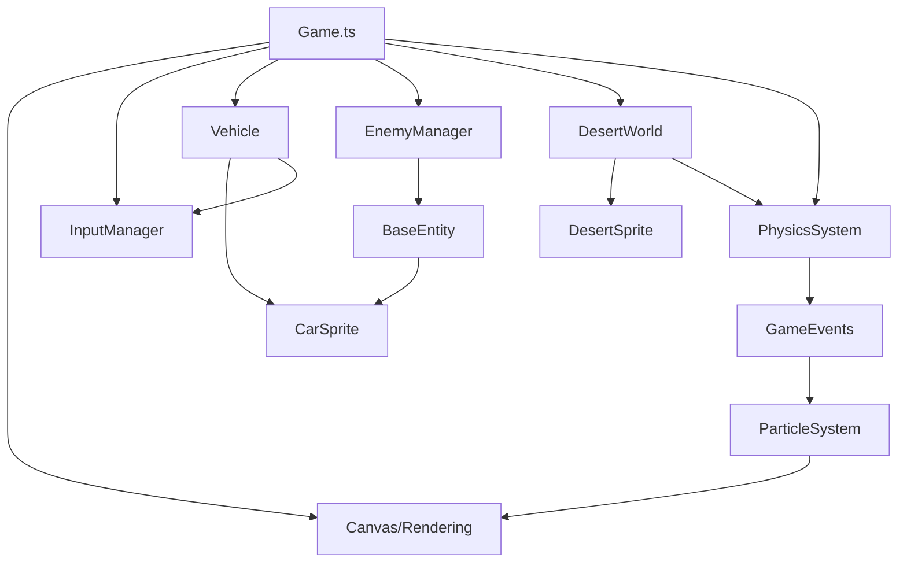

# RaceOn: Current Architecture Analysis

*Date: August 9, 2025*

## Overview

This document analyzes the current RaceOn game architecture to understand the coupling between simulation (game logic) and presentation (rendering/input) layers, and identifies opportunities for separation.

## Current Architecture Assessment

### Strengths Already Present

The codebase already demonstrates several excellent architectural patterns that support simulation/presentation separation:

1. **Event-Driven Design**: The `GameEvents` system provides clean decoupling between systems
2. **Entity Component System**: Well-structured entity registry with behavior composition
3. **Modular Systems**: Physics, collision, AI behaviors are already separated into distinct modules
4. **Configuration-Driven**: `GAME_CONFIG` centralizes parameters for easy testing
5. **Unified Physics**: `PhysicsSystem` handles entity physics consistently

### Current Coupling Analysis

#### High Coupling Areas

**Game.ts (Main Game Loop)**
- **Issue**: Monolithic class handling both simulation and rendering
- **Coupling**: Canvas, rendering context, input handling mixed with game logic
- **Lines**: 507 lines doing everything from asset loading to physics updates

**Entity Rendering**
- **Issue**: Entities contain sprite references and rendering logic
- **Coupling**: `Vehicle.ts` has `CarSprite`, `WaterBanditEntity` has rendering concerns
- **Impact**: Entities can't be tested/simulated without graphics assets

**Input Dependencies**
- **Issue**: Vehicle update directly takes InputManager
- **Coupling**: Core simulation logic depends on input implementation
- **Testing**: Makes headless simulation difficult

#### Medium Coupling Areas

**World Rendering**
- **Issue**: `DesertWorld` contains both collision data and rendering sprites
- **Coupling**: Physics/collision mixed with visual representation
- **Opportunity**: Could separate world data from world rendering

**Asset Management**
- **Issue**: AssetManager tightly coupled to rendering pipeline
- **Impact**: Simulation can't run without asset loading

#### Low Coupling Areas (Already Well Separated)

**Physics System**
- ✅ Pure calculation functions
- ✅ No rendering dependencies
- ✅ Testable in isolation

**Event System**
- ✅ Clean pub/sub pattern
- ✅ No coupling to specific implementations
- ✅ Extensible and testable

**Entity Registry & Behaviors**
- ✅ Data-driven entity definitions
- ✅ Composable behavior system
- ✅ Configuration-based

## Current System Dependencies

## Simulation Core Identification

### Pure Simulation Components (No Changes Needed)
- `PhysicsSystem` - Pure physics calculations
- `Vector2D` - Mathematical utilities  
- `EntityRegistry` - Entity definitions
- `BehaviorRegistry` - AI behavior definitions
- `GameEvents` - Event system
- `CollisionSystem` - Collision detection logic
- Individual behavior classes (`EscapingBehavior`, `ChasingBehavior`)

### Mixed Components (Need Separation)
- `Game.ts` - Contains both simulation and presentation
- `Vehicle.ts` - Has both physics and sprite rendering
- `WaterBanditEntity.ts` - Has both AI and rendering
- `DesertWorld.ts` - Has both collision data and rendering
- `EnemyManager.ts` - Manages both simulation and rendering

### Pure Presentation Components
- `CarSprite`, `DesertSprite` - Visual representation
- `Camera` - View transformation
- `ScreenShake`, `ParticleSystem` - Visual effects
- `DebugRenderer` - Debug visualization
- `AssetManager` - Asset loading

## Separation Feasibility Assessment

### ✅ Highly Feasible (Low Risk)

**Event System Extension**
- Already exists and works well
- Can easily add simulation-specific events
- No breaking changes required

**Entity Data Separation**
- Registry pattern already supports this
- Can separate entity data from rendering
- Behavior system already modular

**Physics Isolation**
- Already well-separated
- No rendering dependencies
- Easily testable

### ⚠️ Medium Feasibility (Some Refactoring)

**Game Loop Separation** 
- Need to extract simulation loop from rendering loop
- Requires careful state management
- Input handling needs abstraction

**World State vs World Rendering**
- DesertWorld contains both collision and rendering
- Need to separate terrain data from visual representation
- Moderate refactoring required

### 🔴 Higher Complexity (Significant Changes)

**Input Abstraction**
- Currently tightly coupled to keyboard events
- Need command pattern or input abstraction
- Affects vehicle control flow

**Asset Dependencies**
- Entities currently reference sprites directly
- Need to abstract visual representation
- May require entity component redesign

## Recommended Approach

Based on this analysis, we should pursue a **gradual separation strategy** starting with the highest-impact, lowest-risk changes:

1. **Phase 1**: Extract simulation core (low risk, high value)
2. **Phase 2**: Separate game loop (medium risk, high value)  
3. **Phase 3**: Abstract input system (higher risk, medium value)
4. **Phase 4**: Entity/rendering separation (higher risk, high value)

This analysis forms the foundation for our separation strategy planning.
